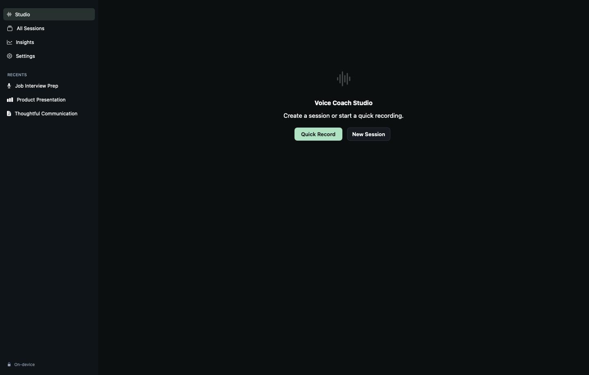
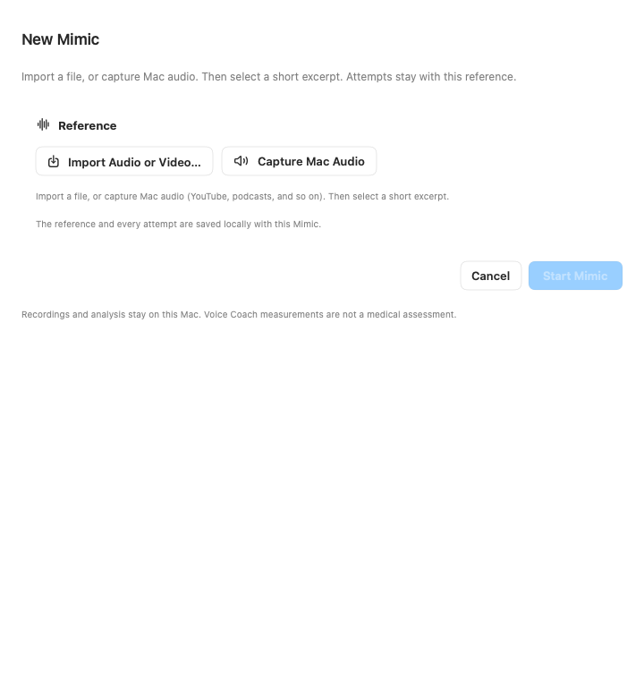
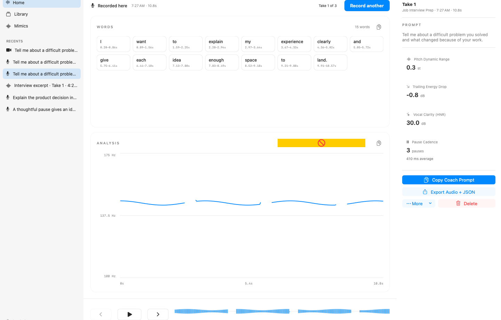
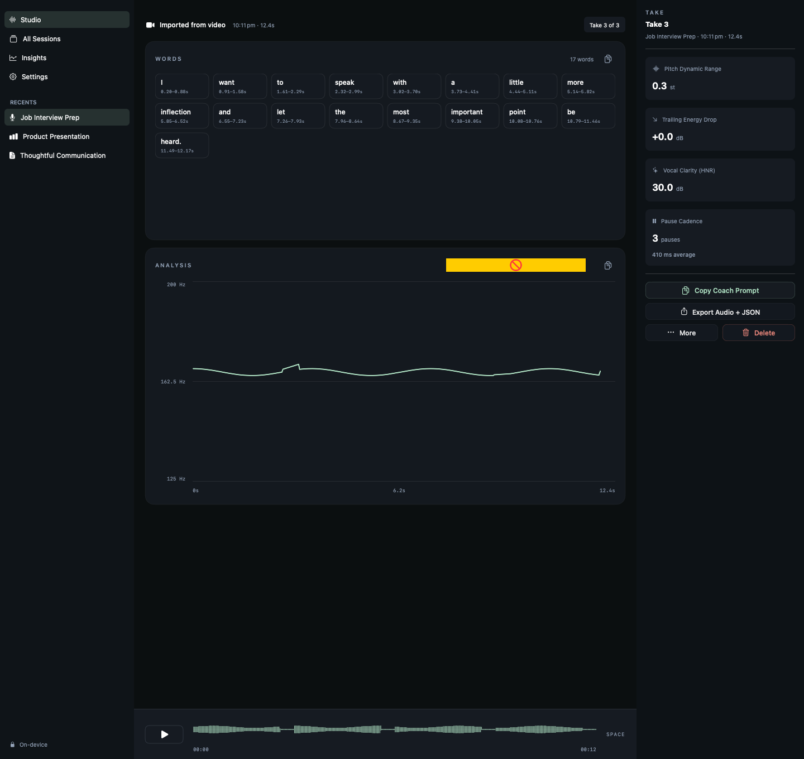
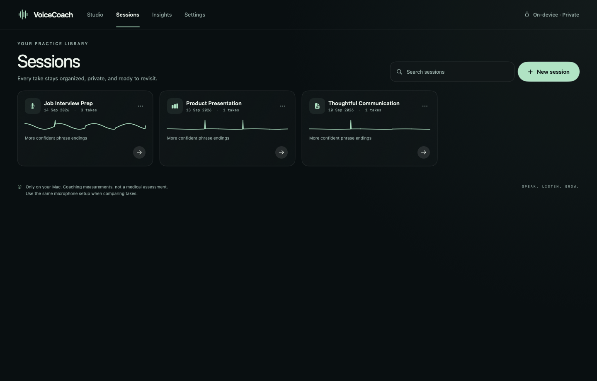
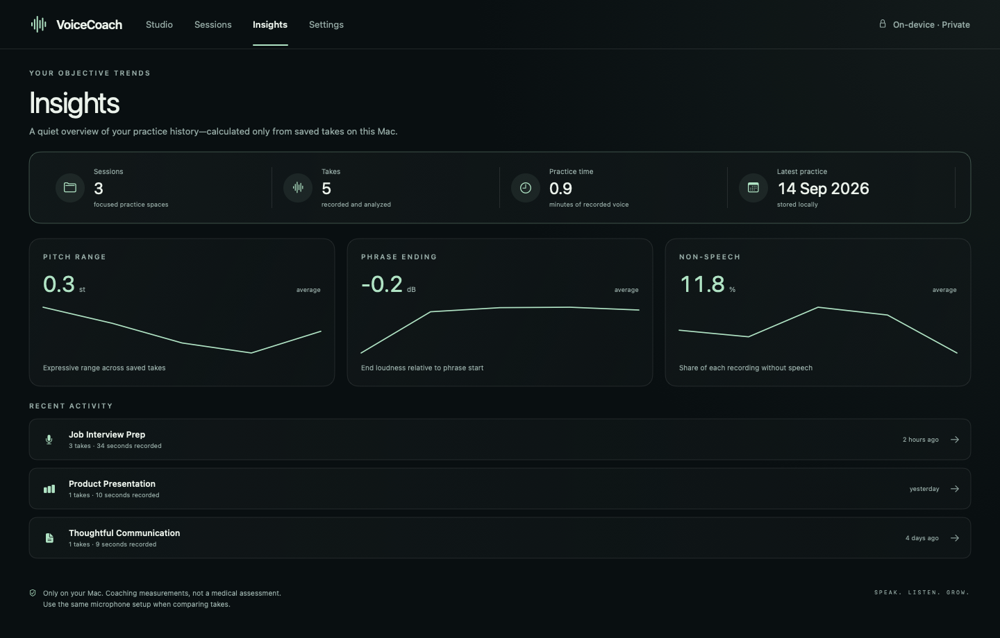
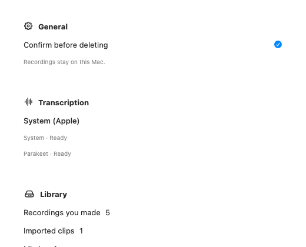
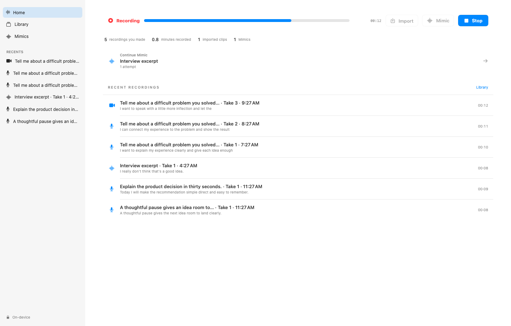

# Voice Coach

A local-first macOS voice practice studio for **macOS 26+**. Record or import on this Mac, inspect acoustic measurements and on-device transcripts, mimic a reference clip, and keep a private library. There is no session setup form.

## Download

Prebuilt app (ad-hoc signed):

**[Voice Coach 3.2.0 for macOS](https://github.com/Gowtham1729/voice-coach/releases/tag/v3.2.0)**

Download `Voice-Coach-3.2.0-macOS.zip`, unzip, and move **Voice Coach.app** to Applications. If Gatekeeper blocks the first launch, right-click the app → **Open**. Voice Coach uses Apple’s on-device transcription by default; Parakeet is an optional local download (~714 MB) under **Settings → Transcription**.

## What you can do

- Hit **Record** on Home, or import audio/video; imports are normalized to a local WAV before analysis
- Open any recording from **Library** without picking a parent folder
- **Record another** to keep related takes in a stack (Take 1, Take 2, …)
- Start **Mimic** from a file or Mac audio, then listen, imitate, compare, and retry against that reference
- Review word-level transcript chips, pitch / loudness / spectrum plots, and a sticky playback timeline
- Copy transcript text, copy an analysis PNG, copy a coach prompt, or export audio + JSON — all on-device

Nothing is uploaded. Recordings, analysis, and transcripts stay under `~/Library/Application Support/VoiceCoach`.

## Screenshots

Fixture layouts of the current studio shell (synthetic audio only — no personal recordings). Offscreen proofs flatten Liquid Glass into opaque materials; the running app on macOS 26+ uses native glass for chrome and controls.

| Home | Mimic start |
| --- | --- |
|  |  |

| Recording (retry stack) | Recording |
| --- | --- |
|  |  |

| Library | Mimics |
| --- | --- |
|  |  |

| Settings | Recording |
| --- | --- |
|  |  |

## Studio shell

The app uses a fixed sidebar (**Home**, **Library**, **Mimics**, **Settings**, plus **Recents**), a focused workspace, and a contextual inspector. Primary chrome adopts Liquid Glass on macOS 26+; content panels stay on standard materials. Reduce Transparency falls back to opaque surfaces; Reduce Motion softens page and graph transitions.

On a recording: tap a transcript word to seek, scrub the sticky waveform timeline (Space to play/pause), and switch Pitch / Loudness / Spectrum. Soft transcription failures still keep the recording and acoustic analysis.

## What it measures

Acoustic coaching signals (not medical measurements — they cannot prove diaphragm use or diagnose a voice condition):

- duration, active speech, and pause ratio
- noise floor, SNR, sample rate, and clipping
- median pitch, pitch range / variation / instability (semitones), and a **24**-value pitch contour
- mean loudness, dynamic range, deviation, phrase-ending decay, and a **24**-value loudness contour
- pause count plus mean, median, and longest pause
- HNR (and related voice-quality estimates used in the UI)
- on-device transcription (Apple by default, optional NVIDIA Parakeet) with word timestamps and per-word pitch / loudness
- waveform and spectrogram in the app UI only (not in exported JSON)

## Run from source

Optional on-device transcription (Apple Silicon): in the app open **Settings → Transcription → Download transcription (~714 MB)**. That installs the NVIDIA NeMo-Speech runtime under Voice Coach’s Application Support folder and pulls Parakeet locally. Acoustic analysis works without it.

Developer alternate (same runtime/model):

```sh
./scripts/setup-transcription.sh
```

Honor a custom binary with `VOICE_COACH_NEMO_SPEECH_PATH` if needed.

```sh
./script/build_and_run.sh
```

The script builds and signs the app bundle, stops an existing development instance, and launches the new build. It also supports `--debug`, `--logs`, `--telemetry`, and `--verify`. The Codex **Run** action uses the same entry point.

Build without launching:

```sh
./scripts/build-app.sh
```

Analysis contract suite:

```sh
./scripts/test.sh --self-test
```

Unit tests for analysis/report contracts and session persistence:

```sh
./scripts/test.sh
```

Layout proofs (synthetic audio only, with a persistence round-trip):

```sh
./scripts/render-previews.sh
```

If macOS reports that the Xcode license is not accepted, run `sudo xcodebuild -license` once in Terminal and accept it yourself.

The package is divided into `VoiceCoachCore` (analysis/transcription), `VoiceCoachSession` (session domain/persistence), and `VoiceCoachApp` (macOS UI/platform services). See [`docs/architecture/README.md`](docs/architecture/README.md) before adding a cross-cutting feature.

## Export

From a take’s inspector you can export the recording with `voice-report.json` (expanded report via `ReportFormatter.makeReport`), including transcription and per-word pitch / loudness. Dense acoustic frames, waveform, and spectrogram stay in the app library and are not part of the export. Copied coach prompts and raw JSON use the same on-device analysis.

## Privacy

Microphone access is requested only when you record. Analysis and optional Parakeet transcription run locally. The recordings index is written atomically; deleting a recording removes its audio and analysis. Deleting a Mimic removes its reference and attempts.
