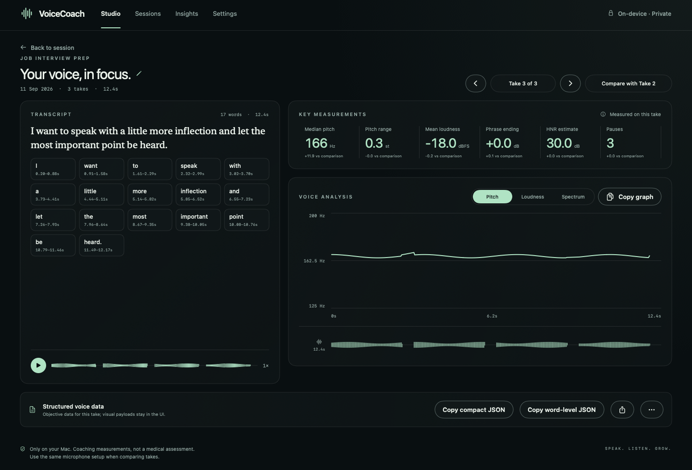

# Voice Coach 3

A local-first macOS voice practice studio. Create focused sessions, record multiple takes, inspect objective acoustic measurements, and build a private practice history that persists between launches.

## Session workflow

- Create named sessions for general practice, reading a prompt, or free speaking.
- Record multiple takes or import an audio/video clip inside one session and move between them without losing earlier work.
- Resume recent sessions from Studio or search the full Sessions library.
- Open any take from its session to inspect the transcript, playback, and acoustic analysis together.
- Inspect aggregate practice activity and objective trends in Insights.
- Keep every recording, or configure a session to retain only its newest take.
- Rename and delete sessions; deleting a session also removes its dedicated recording folder.

The session index, full acoustic analysis, transcripts, word timing, and recordings are stored under `~/Library/Application Support/VoiceCoach`. The index is written atomically and restored when the app launches.

## What it measures

- duration, active speech, and pause ratio
- recording noise floor, SNR, sample rate, and clipping percentage
- median pitch, pitch range, pitch variation, and frame-to-frame pitch instability
- pitch range/deviation in semitones and a 12-value normalized pitch contour
- mean loudness, dynamic range, deviation, and phrase-ending loudness decay
- pause count plus mean, median, and longest pause durations
- HNR and cepstral peak prominence estimates
- a 12-value relative loudness contour
- waveform, pitch/loudness graphs, and spectrogram in the app UI only
- local NVIDIA Parakeet transcription with word start/end timestamps
- timestamp-aligned pitch and loudness measurements for each recognized word

These are acoustic coaching signals, not medical measurements. They cannot prove diaphragm use or diagnose a voice condition.

## Run during development

Install the native local transcription runtime and download Parakeet once:

```sh
./scripts/setup-transcription.sh
```

This uses NVIDIA's official NeMo-Speech.cpp Metal runtime on Apple Silicon and
downloads `nvidia/parakeet-tdt-0.6b-v3` to the NeMo Speech model cache. The
one-time setup needs an internet connection; transcription itself is local and
does not send recordings to a cloud service. The model is roughly 714 MB in its
Q8 GGUF form. Voice Coach also honors `VOICE_COACH_NEMO_SPEECH_PATH` when the
runtime is installed in a custom location.

Then run the app:

```sh
swift run VoiceCoachApp
```

## Build a double-clickable Mac app

```sh
./scripts/build-app.sh
open "build/Voice Coach.app"
```

The exported session contains the locally analyzed audio file and `voice-report.json`. In the app you can copy either the original compact six-section V1 JSON or the expanded report, which preserves those six sections and adds `transcription` and `words`. Each word contains its timestamps plus aligned pitch/loudness summaries. Dense acoustic frames, waveform data, and spectrogram data are not exported. You can import an audio or video file; Voice Coach normalizes its audio to a local WAV before analysis and transcription. Nothing is uploaded. The first recording asks for microphone access. Recordings are stored in the app's Application Support folder and are never uploaded automatically.

If macOS reports that the Xcode license has not been accepted, open Terminal once and run `sudo xcodebuild -license`, review it, and accept it yourself.

## Analysis self-test

```sh
swift run VoiceCoachSelfTest
```

## Version 3 studio

The interface uses an ink-and-mint palette with a fixed source list, a focused session workspace, a complete per-take screen, searchable Sessions, Insights, and Settings. Record with Space, listen back, and switch between pitch, loudness, and spectrum. Selecting a transcript word highlights its time region across the active graph and waveform. The previous successful take stays available if a subsequent recording fails.

The shell uses native SwiftUI navigation, toolbar, list, inspector, and control components. Reduce Motion disables the Take and graph-selection transitions. A matching app icon is included.

The content/control separation follows [Apple's Materials guidance](https://developer.apple.com/design/human-interface-guidelines/materials) and [Meet Liquid Glass](https://developer.apple.com/videos/play/wwdc2025/219/).

## Screenshots

These fixture-based screenshots show the current major flows without including personal recordings or transcripts.

| Studio | Create a session |
| --- | --- |
|  |  |

| Session | Take |
| --- | --- |
|  |  |

| Sessions | Insights |
| --- | --- |
|  |  |

| Settings | Recording state |
| --- | --- |
|  |  |

### Visual checks

```sh
./scripts/render-previews.sh
```

This runs the acoustic/report self-test and generates eight major-screen layout proofs in `build/previews` using synthetic audio only. It also saves and reloads a synthetic session library to verify the persistence round-trip. Preview mode is debug-only and never opens the microphone or reads personal recordings. The offscreen renderer flattens native scrolling and glass into opaque layout representations; these images verify content, spacing and chart states, not live glass refraction, window scrolling or microphone/playback behavior. The shipped app uses native scrolling and Liquid Glass.

For an interactive check, open `build/Voice Coach.app`, create a session, record two 10–30 second takes, open each Take screen, listen back, switch all three chart views, copy JSON, export the WAV/report pair, and relaunch the app to confirm the session returns. Verify keyboard focus, resizing, and the macOS accessibility appearance settings. A live microphone/playback check remains necessary on the running app.
