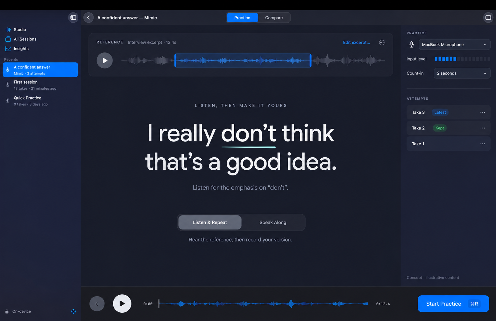
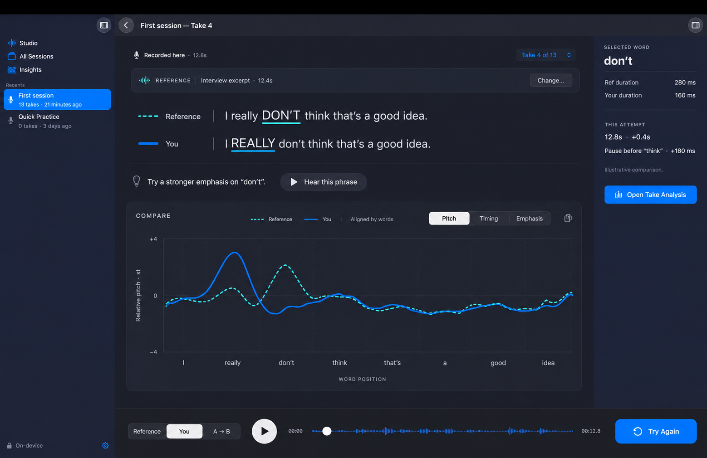
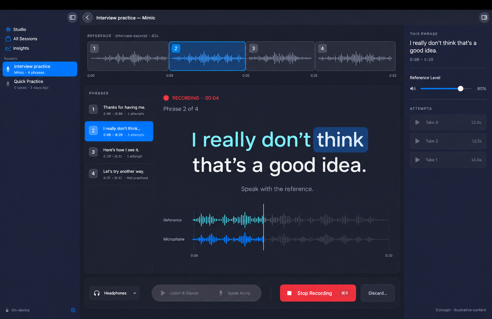

# Mimic: broader design exploration

For the focused first-release recommendation, see [LEAN_PLAN.md](LEAN_PLAN.md). The three concepts here are alternatives explored during design, not three features to implement together.

Design exploration · 17 September 2026. The focused first release in [LEAN_PLAN.md](LEAN_PLAN.md) was selected and implemented; the alternatives below remain future ideas.

## Recommendation

Make **Mimic a session practice mode**, with one owned reference excerpt and many ordinary takes. Give the session two workspaces, **Practice** and **Compare**. Combine Rehearsal Workspace's readable script and recording loop with Comparison Bench's linked transcript and analysis. Keep Phrase Workshop as a later expansion for longer references.

The intended feeling is a small rehearsal studio: listen closely, try something, hear the difference, repeat. The stable reference, script, selected phrase and transport keep the user oriented. Feedback concentrates on one supported, audible difference at a time.

Both **Listen & Repeat** and **Speak Along** belong in the initial release, as explicitly requested. They share reference, script, history and comparison, but have distinct playback/recording behavior.

## Three approaches

### Rehearsal Workspace — practice comes first

Flow: New Mimic session → choose an excerpt → listen/read → start practice → record → compare → try again.

The session opens to a readable script, small reference transport and one primary practice action. Practice/Compare switches the central workspace in place. This provides the clearest default for repeated practice and supports both practice styles. Its cost is one new workspace and explicit recording states.

### Comparison Bench — extend an existing Take

Flow: open a take → choose Compare With… → select a reference → inspect aligned words and curves → record another take → compare again.

The existing Take page gains a pinned reference and comparison analysis. This is the smallest conceptual change for an analytical user and is useful for two existing recordings. Its weakness is discovery: users have to understand a two-take relationship before they can practise. Reading and recording also compete with dense analysis. Borrow this comparison layout for the recommendation, rather than making the pair-picker the main entry point.

### Phrase Workshop — work through a longer source

Flow: import a longer clip → divide into phrases → select a phrase → listen/repeat or speak along → inspect that phrase's attempts → advance when ready.

An internal phrase list and segmented source timeline keep navigation within the selected session. This is strongest for interviews, speeches and accent practice across a passage. It costs a new phrase-management model, local attempt histories and more screen width. A later release can add this without changing the reference/attempt foundations. No automatic advancement based on a score.

### How to read the concepts

The three built-in Image Gen images use the supplied screenshot as their actual visual reference. They show three independent approaches and three important states: ready to practise, reviewing an attempt, and recording along with a reference. They are mockups, not running SwiftUI or evidence of acoustic performance.

The written specification takes precedence over generated details. In particular: use compact flat attempt rows rather than the generated rounded tiles; use sentence case rather than uppercase shouting for emphasis; do not draw future microphone audio as the third image does; replace the first image's duplicate playback affordances with one active transport; keep Open Take Analysis secondary, not prominent blue as in the second image. The final native script should be closer to 24–32 pt at normal window size, not a giant hero headline. Avoid generated decorative background glow. All numbers and words are illustrative.

## Product model and navigation

| Object | Meaning |
| --- | --- |
| Session | Existing `CoachingSession`, with Mimic as a practice mode. Appears in the same sidebar. |
| Reference | Session-owned audio plus analysis/transcript, fixed excerpt boundaries and a stable revision ID. Visually pinned above attempts. Not counted as a user take. |
| Take / attempt | Existing Core `PracticeSession`; “attempt” describes its role in Mimic, not a second recording type. Label history items Take 1, Take 2, etc. |
| Attempt binding | Links a take to its exact reference revision/excerpt, practice style, capture timing and comparison version. |
| Comparison | Derived result with word matches, gaps, metric availability, measurements and supported observations. Does not overwrite either take's original analysis. |

Do not add Mimic as a fourth global sidebar destination. Add it to the existing New Session practice-mode selection, using a popup if four segmented options would crowd the sheet. On any existing Take, add **Mimic This…** to the contextual menu and More menu. It creates a new Mimic session with an owned local copy of that take as the reference; it does not convert the old session or move its take.

V1: one reference excerpt per session. After attempts exist, choosing a different reference or changing excerpt boundaries offers **Create New Mimic Session…** with the old session intact. This prevents old comparisons from silently changing their target. Multiple excerpts within one session is the Phrase Workshop expansion.

Attempts save automatically. A star means Favorite, not Saved; every completed take is already saved. Do not automatically crown a “best” attempt from an unvalidated composite score. Exclude reference audio from user practice totals.

## Recommended journey

### 1. Create or start from an existing Take

In New Session, selecting Mimic replaces the optional written-prompt field with a compact reference chooser: **Import Audio or Video…**, **Choose Existing Take…**, and secondary **Record Reference…**. Support dropping a local audio/video file into the reference area. A file-derived name is editable; no mandatory naming exercise.

The reference chooser is preparation, not another take-creation dashboard. Import normalizes audio locally using the existing service; video is an audio source in V1, with no promise of lip/video playback. Existing-take selection uses a searchable sheet grouped by session. Recording a reference is labelled explicitly so users do not confuse it with their attempt.

Keep provisional files in staging until creation succeeds. Cancelling cleans staged files without touching a source recording. Finishing preparation commits the session and owned reference together.

### 2. Prepare an excerpt

Use a compact Prepare Reference sheet, approximately 760 × 560 points when space allows: filename/name at top; waveform with trim handles and editable start/end fields; natural transcript beneath; duration and playback controls; **Use Excerpt** primary action. Recommend roughly 5–20 seconds as guidance, not a hard minimum or a silent truncation rule. Permit selecting a short range from a longer file.

Selecting a sentence proposes its audio range; handles and numeric fields provide precise and keyboard-accessible correction. Preserve some context at word boundaries. Listen to the selected excerpt before accepting. Keep source audio immutable and store the range non-destructively, using a derived trimmed file when required by existing analysis.

Transcribe and analyze the selected range locally. Display real stages such as “Preparing audio” and “Transcribing on this Mac”; do not invent progress percentages. Missing transcription does not prevent creating the session or practising. The script can be manually entered as a reading aid, but typed text does not magically acquire word timestamps. Manual text corrections invalidate any affected automatic word matches until reprocessing validates them.

### 3. Ready to practise

Keep the sidebar selection and session title fixed. In the main toolbar use **Practice | Compare**; disable Compare until there is an attempt, with an explanation. Place a compact pinned reference label above a naturally wrapped script. Show timestamps only on selection/inspection, not under every word. On initial entry the screen has no asserted coaching advice; after a comparison, it can carry the user's chosen focus into the next attempt.

The persistent bottom bar has the active reference transport, practice-style picker and one **Start Practice** action. Practice style is remembered for the session. Reference playback highlights known timed words and can loop a selected phrase. Clicking a word selects it; playing it is a distinct action. Shift-click extends a range; dragging the waveform selects a time range. For V1, focus playback can isolate a phrase, while a scored retry still records the whole committed excerpt.

Inspector: microphone, output device, input meter, optional two-second count-in and reference volume. Keep the core loop fully usable with the inspector hidden. Restore the user's inspector visibility preference rather than reopening it on every state transition.

### 4. Listen & Repeat

Start Practice → play reference → stop reference → visible two-second count-in → record microphone → user presses Stop → save/analyze → Compare.

The button becomes **Stop Recording** while recording. A secondary **Record Now** action skips reference playback if it has just been heard; Try Again can use this without requiring a second listen. Remember the user's replay preference. At initial setup, a brief sentence explains that recording follows playback automatically.

During recording, show the script, microphone level/waveform and elapsed time. Do not move the word highlight according to reference timing while the user speaks independently; live recognition is not assumed. Do not show live accuracy, pitch chasing, corrective popups or an invented user transcript. Use the existing recording duration limit, not the reference length, so slower attempts are not cut off. Stop remains explicit in V1.

### 5. Speak Along

Start Practice → visible count-in → start reference playback and microphone capture on a coordinated timeline → user speaks with the reference → reference ends → small visible finish window → stop/save/analyze → Compare. Allow manual Stop at any time and a visible Keep Recording override for the finish window; do not unexpectedly cut off the last word. Keep the initial implementation at original playback speed.

Timed highlighting follows the reference audio; it is a pacing guide, never claimed to follow the user's voice. Reference volume is adjustable. Record only the microphone stream, not a software mix of reference and microphone. Disable self-monitoring by default. Explain headphones inline because reference sound through speakers can contaminate the recording; do not claim perfect headphone detection or automatic leak removal. Permit practice if the user continues on speakers, but suppress unreliable comparison rather than reporting false accuracy.

Capture device/output timing and account for recording-start and route latency where measurable. Separate intentional following delay, capture offset and word-duration differences. Do not grade all lag as incorrect rhythm. Unknown latency makes onset-based comparison unavailable; aligned contour and listening may still be useful. Route changes/interruption stop the reference and recover/save a partial take where possible, marked incomplete. Bluetooth, wired and built-in routes need real device tests.

### 6. Review one difference

Save the attempt first. Then open Compare in the same session. Keep its transcript, selected range and bottom transport visually aligned with Practice. Comparison work must not make a saved take disappear if alignment fails.

Show one short, evidence-backed observation above the transcript, such as “The pause before ‘think’ is 180 ms longer.” Pair it with **Hear Difference**, which plays the same selected phrase from the reference, a short gap, then the attempt. A modest next action might read “Try a shorter pause here.” No LLM is required for this templated wording.

Select a focus only when correspondence and measurement quality support it. Rank candidate differences within evaluated metric rules, not by comparing unlike raw numbers. If no reliable difference is available, say so and offer A/B listening. Users can ignore the suggestion or choose another word; “largest” must not imply a complete or objectively optimal coaching diagnosis.

Use blue/solid for You and cyan/dashed for Reference, with labels and accessible contrast. Do not rely on color alone. One chart at a time, with **Pitch | Timing | Emphasis**. Keep original Spectrum and HNR in Open Take Analysis. There is no need for seven top-level metric tabs.

| Comparison | Main visual and meaning | Guardrail |
| --- | --- | --- |
| Pitch | Two relative pitch curves, centered per speaker in semitones, aligned by matched words. Common vertical scale. | Compare shape without requiring the user to adopt the reference's absolute voice height. Do not independently rescale each range to look identical. Unvoiced/unreliable sections stay gaps. |
| Timing | Two rows of proportional word durations and pause spans, with actual elapsed-time axes. | Keep real timing visible; contour alignment must not erase the timing differences being measured. Distinguish clip-leading silence from internal pauses. |
| Pauses | Visible gaps inside Timing; selecting a gap inspects its location and durations. | An unmatched word is not automatically a pause. |
| Rhythm | Phrase-level distribution of word lengths and pauses, also inside Timing. | Avoid inventing a separate rhythm score. Assess only sufficiently matched phrases. |
| Emphasis / loudness | Paired per-word relative energy markers, with pitch and duration evidence in inspector. | Normalize recording-level gain. Absolute dB from two microphones is not a fair loudness target; acoustic prominence is not proof of linguistic stress. Start with measured energy/duration observations until inference is evaluated. |
| Pronunciation / phonemes, later | Selected-word inspector: target IPA with accent/source, pronunciation audio where available; detected sounds only if validated. | Dictionary pronunciation is a target, not proof of what either speaker produced. Missing or uncertain observations remain unavailable. No empty Pronunciation tab in V1. |

The chart explicitly labels **Aligned by words** for contour view, and **Actual timing** for Timing. Alignment is a display mapping; A/B audio plays at its recorded speed. No invisible time stretching. Original Hz/dB values remain available in individual analysis.

### 7. Retry and browse attempts

**Try Again** is always visible in Compare. It preserves the reference/excerpt, practice style, microphone, count-in and selected focus, stops playback, then returns to recording readiness without another sheet or name field. Each complete recording appends a new take.

Use the existing Take picker location for history, enriched with timestamp, duration, practice style and optional Favorite. Its popover can display a compact native list. Previous/next attempt shortcuts make browsing quick. Do not put core attempt navigation exclusively in the inspector.

Switching attempts preserves the selected metric and reference-relative phrase when it has a valid correspondence; otherwise clear the word selection. Stop playback before switching. Restore that take's saved comparison, and always show the chosen take number clearly. The reference remains the comparison target: choosing a previous take must not silently replace it.

Progress is specific: for the same excerpt and trustworthy metric, show “Pause difference: +420 ms → +180 ms” comparing the previous and selected take. Label the compared takes. Offer **Previous → Current** playback separately from **Reference → You**. Different style or capture conditions are labelled; suppress misleading cross-condition timing trends. Use “closer to reference” rather than claiming universally better speech.

## Native interaction contract

| Input or state | Behavior |
| --- | --- |
| Space | Play/pause active source when idle or comparing, preserving current Take behavior. Never unexpectedly begins recording. During recording, it does not operate reference playback independently. |
| Command-R | Start the visible Mimic recording action; while capturing, Stop Recording. Scoped to the active Mimic workspace. |
| Existing shortcuts | Preserve Command-Shift-R Quick Recording, Command-Shift-I Import Recording and Command-1/2/3 navigation. Disable competing capture actions during a Mimic operation. |
| Option-Left / Option-Right | Previous/next attempt when the workspace owns focus. Keep current plain arrow word-navigation behavior. |
| Escape | Cancel a count-in; dismiss selection/popover. While recording, stop and retain a partial draft for recovery; do not silently delete. |
| Text editing | Plain Space/arrows stay with the field/editor. Focused commands must not steal typing. |
| Word click | Persistent selection across transcript, chart and inspector. No surprise autoplay. Double-click or explicit Play Selection plays the active source range. |
| Hover | Subtle underline/tint and optional timestamp help. Hover never changes persistent selection or starts audio. Essential details also accessible by keyboard and inspector. |
| A/B | Reference range, short gap, corresponding attempt range. Source and current phase are labelled. Stop cancels the whole sequence. Disable range A/B when no safe correspondence exists; allow whole-clip sequential listening. |
| Context menu | Play Selection, Loop Selection, Focus Next Attempt; attempt items expose Favorite, Open Take Analysis, Export and Delete. |
| Recording | Keep controls stable; lock reference/style changes and attempt switching. No auto-navigation, resizable-layout jumps or live scores. |
| Narrow window | Honor existing 920 × 640 minimum. Collapse optional inspector/sidebar when requested; wrap script and analysis controls. Do not squeeze in a fourth persistent column. |
| Accessibility | VoiceOver names active source, selected words, recording status and units. Offer table/text equivalents for charts; respect Reduce Motion/Transparency and Light/Dark appearance. |

Use the existing `NavigationSplitView`, native `.toolbar`, `.inspector` and system buttons. System chrome can use glass; transcript/analysis use existing standard content materials. No new global dashboard, full-screen onboarding, achievement rings, detached player, or repeated metric-card grid.

## New surfaces versus extensions

| Surface | Proposed change |
| --- | --- |
| New Session sheet | Add Mimic mode and reference source chooser. Compact controls rather than a multi-page onboarding wizard. |
| Prepare Reference sheet | New focused trim/transcript preview surface. Reuses import, playback and analysis services. |
| Session workspace | New Mimic Practice composition; ordinary session workspace stays available unchanged. |
| Compare workspace | Extend/extract the current Take transcript, chart and sticky transport components; add linked reference context. Keep ordinary Take view accessible through Open Take Analysis. |
| Inspector | Practice equipment/settings → whole-attempt comparison summary → selected-word/range details, according to state and selection. |
| History | Extend existing Take picker. No global Attempts destination. |

The inspector remains supplementary and selection-based, consistent with Apple's [Inspectors in SwiftUI](https://developer.apple.com/videos/play/wwdc2023/10161/). Standard navigation and toolbar containers also provide the system's current material treatment: [Build a SwiftUI app with the new design](https://developer.apple.com/videos/play/wwdc2025/323/). These are platform references, not evidence that the proposed acoustic feedback has been validated.

## Failure and recovery states

- **No speech model / transcription failed:** save audio and acoustic analysis; allow listening and both practice styles. Show “Word comparison unavailable” with setup/retry action. User-entered script is a reading aid only until timed alignment exists.
- **Different wording / partial recording:** distinguish omitted, inserted and unmatched words. Compare supported matches only. Do not force a smooth whole-clip overlay or treat ASR disagreement as proven pronunciation error.
- **Music, multiple speakers, noise, clipping or little voiced speech:** suggest a cleaner single-speaker excerpt; keep audio practice available. Gate individual metrics on their actual quality criteria. Avoid diagnosis and invented confidence percentages.
- **Missing reference audio:** show Locate Reference… and preserve attempts and original take analysis. Replacing content creates a new target revision/session rather than silently relinking to unrelated audio.
- **Permission denied / disconnected input:** explain the exact device/access issue and retain the ready state. A cancelled permission request is not a recorded attempt.
- **Analysis failure:** retain the recorded file and offer Retry Analysis. A failed comparison is not a failed recording.
- **Save failure / low storage:** retain staged capture, display unsaved state and offer retry/export. No “saved” confirmation before an atomic persistence success.
- **Deletion:** deleting an attempt must not delete reference audio. Whole-session deletion follows existing confirmation. Reference cannot be removed behind existing comparisons. “Keep only newest” is not available for a Mimic session; setup explicitly says “Reference and all attempts are saved on this Mac.”

## Implementation plan after design selection

### 1. Validate the visual and interaction contract

Implement native DEBUG fixture previews for prepare, ready, Listen & Repeat capture, Speak Along capture, comparison, selected word and unavailable comparison. Wire a fixture-driven loop to confirm control placement and keyboard focus before acoustic integration. Check 1240 × 800 and minimum window size, Light/Dark, inspector hidden and accessibility settings. These previews prove layout only.

### 2. Add owned references and safe persistence

Start in `SessionLibrary.swift` and `AppModel.swift`. Add a Mimic session configuration with an owned reference snapshot, immutable excerpt identity and attempt bindings. Retain `PracticeSession` as the take model. Avoid a cross-session URL dependency when starting from an existing take.

Propose schema version 2 with an explicit v1 → v2 migration and backup, because the current loader accepts only version 1 and an added mode is not safely backward-readable by old binaries. Test v1 loading, v2 round-trip, unknown future version handling, migration failure and atomic save rollback. Do not claim old releases can reopen a v2 library. Keep exported report contracts unchanged; comparison export can be a separate later contract.

Update deletion and retention before adding recording: current `AppModel.append` replaces all takes and removes their WAVs when `keepsRecordings` is false. That behavior must never consume a Mimic reference or attempt history. Stage and own reference files inside session storage.

### 3. Deliver both recording styles

Reuse audio import/analysis, then introduce a dedicated `MimicPracticeController` with explicit states: preparing, ready, playingReference, countingIn, recordingRepeat, recordingAlong, saving, analyzing, comparing and recoverableFailure. UI follows state; individual views do not each own separate recording booleans.

The current `AppModel.beginRecording` stops playback, and `AudioRecorder` supplies one player plus a recorder. Speak Along needs a deliberate coordinated audio path, not simply removing that stop call. Prototype scheduling, excerpt stop, microphone-only capture and route timing behind a small audio-coordination service. Preserve existing ordinary recording/playback semantics. No new dependency is assumed or authorized by this proposal.

Save the recording before optional transcription/comparison; separate recoverable failures. Snapshot session, reference and take IDs when work begins so navigation cannot attach asynchronous results to the wrong object. Have one owner of audio focus across app windows.

### 4. Build explainable comparison

Add small Core types/services for transcript correspondence, word/time mapping and per-metric comparison. Reuse full-resolution `AcousticFrameData` and `WordAcousticAnalyzer`; do not compare exported 24-value contours or chart pixels. Begin with same-text recordings and explicit gaps for mismatch. Preserve raw duration/pauses separately from any contour alignment.

Evaluate each observation before promoting it to coaching copy. Use deterministic synthetic fixtures for shifts, changed gain, altered duration, inserted pauses, missing words and unvoiced spans. Add consented or synthetic reference/attempt pairs with human-reviewed correspondence for alignment evaluation. Percent similarity, composite “match” and confident stress classification remain out until calibrated against examples.

### 5. Integrate Compare and the retry loop

Extract reusable Take content only where needed; likely files are `TakeView.swift`, `TranscriptBrowser.swift`, `Charts.swift`, `DesktopShell.swift` and `ContentView.swift`. Add a comparison transport that maps selection between recordings while keeping original playback speed. Reuse current analysis and export routes. Add native Commands in `VoiceCoachApp.swift` with state-aware availability.

### 6. Validate the complete release

Run `VoiceCoachSelfTest` after Core/report changes, `scripts/build-app.sh`, and `scripts/render-previews.sh` for UI/persistence fixtures. Then perform real headphone/microphone sessions in both styles: reference import → first take → A/B → three retries → switch attempts → relaunch → reference still plays. Exercise Bluetooth/wired timing, interruption, permission denial, missing transcript, mismatched words, save failure and deleting an attempt. Device audio, synchronization and ease of use require live tests; screenshots and synthetic tests cannot establish them.

Acceptance: users can prepare a reference without learning a new hierarchy, finish either practice style, hear the same phrase in both recordings, understand one supported difference, retry with one action, and revisit any saved attempt. No misleading score or missing transcript may block basic practice. Existing recording/import/report flows must still pass their contracts.

## Initial release boundary

Include one reference excerpt per Mimic session, all three source paths, both practice styles, readable script, optional count-in, explicit stop, automatic saving, A/B listening, reliable pitch/timing/relative-energy comparison, per-word selection, retries and attempt history.

Later: phrase queue, multiple reference excerpts, pitch-preserving playback speed controls, target IPA, validated observed phonemes, calibrated aggregate scores, generated improved-self audio and optional language-model coaching. No cloud audio path is implied.

## Image-generation provenance

Generated with the built-in Image Gen tool, using `/var/folders/0c/m_nwclb97hl6_7fzn82xgf1w0000gn/T/codex-clipboard-b9e69e87-d889-4b6b-bb57-7856b34b3f38.png` as the attached existing-app style reference for each independent call. The generation prompts are preserved in this task's tool history. Target dimensions in each prompt: 2048 × 1328, matching the supplied screenshot's aspect approximately. Concepts are copied alongside this proposal so they do not depend on a generated-images cache.
